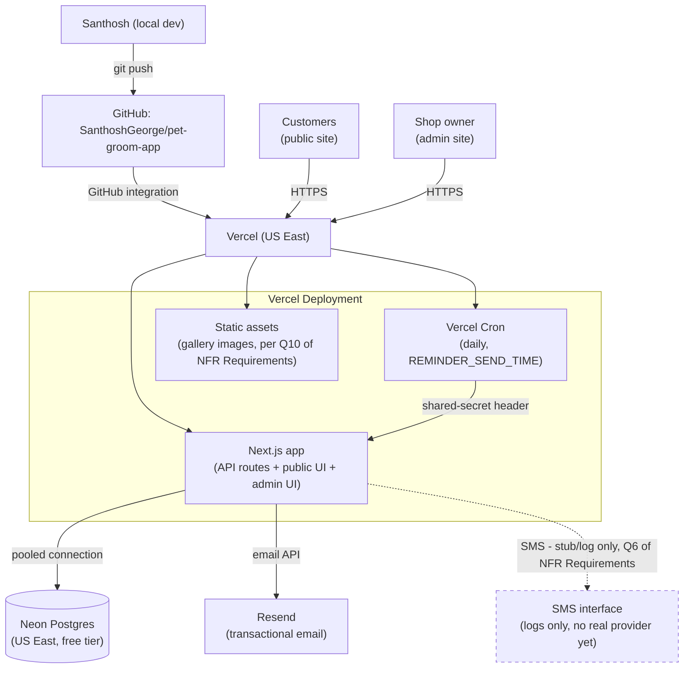

# Deployment Architecture — Pet Grooming Booking Platform

## Diagram



### Text Alternative

```
Santhosh (local dev) --push--> GitHub repo --Vercel GitHub integration--> Vercel (US East)
Vercel hosts: Next.js app (API + public UI + admin UI), Vercel Cron (daily reminder job), static gallery assets
Next.js app --pooled connection--> Neon Postgres (US East, free tier, backups on free-tier default)
Vercel Cron --shared-secret header--> Next.js app's reminder API route
Next.js app --email API--> Resend (transactional email)
Next.js app -.stub, logs only.-> SMS interface (no real provider connected yet)
Customers and shop owner --HTTPS--> Vercel (public site and admin site respectively)
```

## Request Flow Examples

**A customer books an appointment (GC-2):**
1. Browser (public site, served from Vercel) submits the booking form
2. Next.js API route runs `booking`'s `createBooking` flow (`booking-business-logic-model.md` Flow 1)
3. Reads/writes go through the pooled connection to Neon (the slot-claim insert relies on the database's uniqueness constraint, per NFR Design)
4. On success, the same request calls Resend (email) and logs the SMS that would have been sent (stub, per NFR Requirements Q6)
5. Response returns to the browser with the booking confirmation

**The daily reminder job runs:**
1. Vercel Cron fires once daily at `REMINDER_SEND_TIME`, calling the reminder API route with the configured shared-secret header
2. The route verifies the secret, then runs `notification-business-logic-model.md`'s Flow 3 against Neon (find due `ScheduledReminder` rows, send, mark `Sent`)
3. Failures (email or the SMS stub) set `Appointment.notificationFailed`, visible to the owner on their next admin-calendar view

## Environment Variables (Vercel Environment Variables, per Q5)

| Variable | Purpose |
|---|---|
| `DATABASE_URL` | Neon pooled connection string |
| `SESSION_SECRET` | Signs/encrypts session cookies (BR-AUTH-4) |
| `RESEND_API_KEY` | Transactional email |
| `CRON_SECRET` | Shared secret checked by the reminder job's API route (NFR Design Q7) |

(SMS provider credentials are intentionally absent — the stub implementation needs none; adding real SMS later means adding a `TWILIO_*` set of variables, not restructuring anything above.)

## What Changes When Real SMS Is Approved

Called out explicitly since NFR Requirements flagged this as the one pending cost decision: swapping the SMS stub for real Twilio sending is a scoped, contained change —
1. Add Twilio credentials to Vercel Environment Variables
2. Swap the stub implementation behind `notification`'s SMS-send interface (already designed as independent from email, per BR-NOTIF-3) for a real Twilio API call
3. No change to any other module, no change to the database schema, no change to the deployment architecture above

## What Changes When a Custom Domain Is Ready

Also scoped and contained: add the domain in Vercel's dashboard, update DNS records at whatever registrar the groomer uses, done — no code or infrastructure change beyond that.
