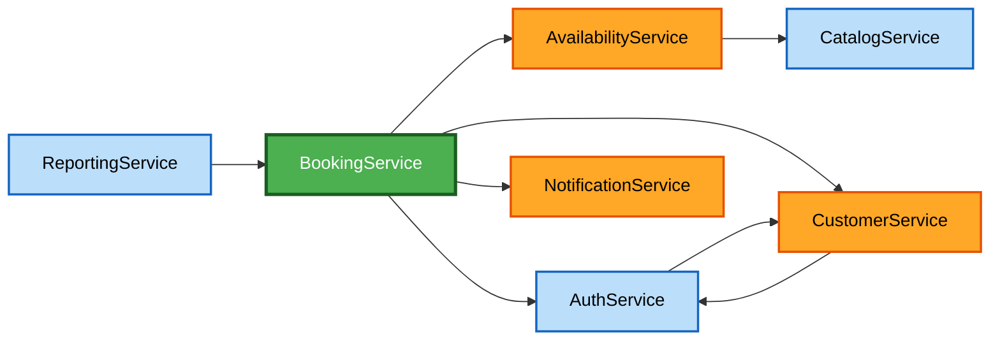

# Component Dependencies — Pet Grooming Shop Booking App

## Dependency Matrix

| Component | Depends On | Reason |
|---|---|---|
| AuthService | CustomerService | Registration links a new login to an existing/new Owner record |
| CustomerService | AuthService | Guest-to-account linking needs an auth identity to attach |
| CatalogService | *(none)* | Foundational — services/prices have no dependency on anything else |
| AvailabilityService | CatalogService | Needs a service's duration to compute correctly sized slots |
| BookingService | AvailabilityService, CustomerService, NotificationService, AuthService | Coordinates all of them directly (no separate orchestrator, per Q4) |
| NotificationService | *(none)* | Receives everything it needs (appointment + contact info) as input — no reverse dependency on BookingService |
| ReportingService | BookingService | Reads appointment data to compute summaries |

**Note on AuthService ↔ CustomerService**: this is the one circular-looking relationship — AuthService needs an Owner reference to register against, and CustomerService needs an auth identity to mark an owner as account-linked. In practice this resolves to two separate calls in sequence (see services.md's RC-1 flow: `AuthService.registerAccount` calls `CustomerService.linkAccount` as its second step), not a runtime cycle.

## Communication Pattern

All calls shown are direct, synchronous component-to-component calls (in-process function calls if these end up as modules in one app, or synchronous requests if they end up as separate services — that's an Infrastructure Design decision, not fixed here). The one exception is the day-before reminder in NotificationService, which is time-triggered rather than caller-triggered — its scheduling mechanism (cron, queue, etc.) is deferred to NFR Design / Infrastructure Design.

## Dependency Diagram



### Text Alternative
```
AuthService <-> CustomerService (mutual, resolved as sequential calls, not a runtime cycle)
AvailabilityService -> CatalogService (needs service duration)
BookingService -> AvailabilityService, CustomerService, NotificationService, AuthService (coordinates all directly)
ReportingService -> BookingService (reads appointment data)
```

## Data Flow Summary

- **CatalogService** and **AuthService**/**CustomerService** are the most foundational — little upstream dependency, used by everything else.
- **BookingService** is the hub — nearly everything a user does eventually routes through it, consistent with it being the core of the system per components.md.
- **NotificationService** and **ReportingService** are the two "leaf" components — they consume data but nothing depends on them, which keeps them easy to change or swap later (e.g., switching email/SMS providers) without touching the rest of the system.
