# Execution Plan

## Detailed Analysis Summary

### Change Impact Assessment
- **User-facing changes**: Yes — this is a brand-new public booking site plus an admin view; nothing exists today.
- **Structural changes**: Yes — new system from scratch (greenfield), no existing architecture to preserve.
- **Data model changes**: Yes — new schema for Owners, Pets, Services, Groomers, Appointments.
- **API changes**: Yes — all endpoints are new (availability, booking, cancellation, admin management, notifications).
- **NFR impact**: Yes — tech stack, hosting, and notification delivery are all undecided and need explicit selection; the double-booking race condition called out in GC-2/RC-2 needs a concrete concurrency-handling approach.

### Risk Assessment
- **Risk Level**: Low-Medium — standard CRUD + scheduling patterns, no novel algorithms, but real money/reputation is on the line for a live small business, and the concurrency edge case (double-booking) needs to be handled correctly, not just described.
- **Rollback Complexity**: Easy — greenfield, free-tier preview deployments, nothing in production yet.
- **Testing Complexity**: Moderate — availability/booking logic and the notification timing (day-before reminder) both need real test coverage, not just manual spot-checks.

## Workflow Visualization

```mermaid
flowchart TD
    Start(["User Request"])

    subgraph INCEPTION["INCEPTION PHASE"]
        WD["Workspace Detection<br/>COMPLETED"]
        RA["Requirements Analysis<br/>COMPLETED"]
        US["User Stories<br/>COMPLETED"]
        WP["Workflow Planning<br/>IN PROGRESS"]
        AD["Application Design<br/>EXECUTE"]
        UG["Units Generation<br/>EXECUTE"]
    end

    subgraph CONSTRUCTION["CONSTRUCTION PHASE"]
        FD["Functional Design (per unit)<br/>EXECUTE"]
        NFRA["NFR Requirements (per unit)<br/>EXECUTE"]
        NFRD["NFR Design (per unit)<br/>EXECUTE"]
        ID["Infrastructure Design (per unit)<br/>EXECUTE"]
        CG["Code Generation (per unit)<br/>EXECUTE"]
        BT["Build and Test<br/>EXECUTE"]
    end

    subgraph OPERATIONS["OPERATIONS PHASE"]
        OPS["Operations<br/>PLACEHOLDER"]
    end

    Start --> WD
    WD --> RA
    RA --> US
    US --> WP
    WP --> AD
    AD --> UG
    UG --> FD
    FD --> NFRA
    NFRA --> NFRD
    NFRD --> ID
    ID --> CG
    CG --> BT
    BT -.-> OPS
    BT --> End(["Complete"])

    style WD fill:#4CAF50,stroke:#1B5E20,stroke-width:3px,color:#fff
    style RA fill:#4CAF50,stroke:#1B5E20,stroke-width:3px,color:#fff
    style US fill:#4CAF50,stroke:#1B5E20,stroke-width:3px,color:#fff
    style WP fill:#4CAF50,stroke:#1B5E20,stroke-width:3px,color:#fff
    style AD fill:#FFA726,stroke:#E65100,stroke-width:3px,stroke-dasharray: 5 5,color:#000
    style UG fill:#FFA726,stroke:#E65100,stroke-width:3px,stroke-dasharray: 5 5,color:#000
    style FD fill:#FFA726,stroke:#E65100,stroke-width:3px,stroke-dasharray: 5 5,color:#000
    style NFRA fill:#FFA726,stroke:#E65100,stroke-width:3px,stroke-dasharray: 5 5,color:#000
    style NFRD fill:#FFA726,stroke:#E65100,stroke-width:3px,stroke-dasharray: 5 5,color:#000
    style ID fill:#FFA726,stroke:#E65100,stroke-width:3px,stroke-dasharray: 5 5,color:#000
    style CG fill:#4CAF50,stroke:#1B5E20,stroke-width:3px,color:#fff
    style BT fill:#4CAF50,stroke:#1B5E20,stroke-width:3px,color:#fff
    style OPS fill:#BDBDBD,stroke:#424242,stroke-width:2px,stroke-dasharray: 5 5,color:#000
    style Start fill:#CE93D8,stroke:#6A1B9A,stroke-width:3px,color:#000
    style End fill:#CE93D8,stroke:#6A1B9A,stroke-width:3px,color:#000

    linkStyle default stroke:#333,stroke-width:2px
```



### Text Alternative
```
INCEPTION: Workspace Detection (done) -> Requirements Analysis (done) -> User Stories (done)
         -> Workflow Planning (in progress) -> Application Design (execute) -> Units Generation (execute)
CONSTRUCTION (per unit, repeated for each unit of work):
         Functional Design (execute) -> NFR Requirements (execute) -> NFR Design (execute)
         -> Infrastructure Design (execute) -> Code Generation (always)
         -> after all units: Build and Test (always)
OPERATIONS: placeholder, not yet active in this toolkit version
```

## Phases to Execute

### 🔵 INCEPTION PHASE
- [x] Workspace Detection (COMPLETED)
- [x] Requirements Analysis (COMPLETED)
- [x] User Stories (COMPLETED)
- [x] Execution Plan (IN PROGRESS)
- [ ] Application Design — **EXECUTE**
  - **Rationale**: Multiple new components with distinct responsibilities are needed (booking/availability, customer/pet records, notifications, admin/reporting) — component boundaries and their methods should be defined before splitting into units, not discovered ad hoc during coding.
- [ ] Units Generation — **EXECUTE**
  - **Rationale**: New data models, new API surface, and enough business logic (availability computation, multi-pet booking, owner overrides, day-before reminders) to benefit from being decomposed into clearly scoped units rather than built as one undifferentiated blob.

### 🟢 CONSTRUCTION PHASE
*(Per-unit stages below apply generally; each unit gets a final EXECUTE/SKIP call during its own turn in Construction, since a very simple unit may not need all four.)*
- [ ] Functional Design — **EXECUTE**
  - **Rationale**: Real business logic to nail down precisely — availability computation, multi-pet booking, cancellation rules, override behavior, reminder timing/suppression-on-cancel.
- [ ] NFR Requirements — **EXECUTE**
  - **Rationale**: Tech stack (framework, database, hosting) is not yet chosen; this is where that gets decided against NFR-1 (low-maintenance managed services) and NFR-3 (headroom to grow beyond one groomer).
- [ ] NFR Design — **EXECUTE**
  - **Rationale**: The double-booking race condition (explicit edge case in GC-2/RC-2) needs a concrete concurrency-safe design (e.g., a DB-level constraint or transaction), not just a description — this is exactly what NFR Design is for. Kept lightweight given Security Baseline and Resiliency Baseline extensions were opted out (13B, 14B).
- [ ] Infrastructure Design — **EXECUTE**
  - **Rationale**: Need to map the NFR decisions to actual services — hosting platform, database provider, email/SMS providers for FR-10's notifications.
- [ ] Code Generation — **EXECUTE (ALWAYS)**
  - **Rationale**: Implementation planning and code generation needed for every unit.
- [ ] Build and Test — **EXECUTE (ALWAYS)**
  - **Rationale**: Build, test, and verification needed, including test coverage for the availability/concurrency logic and the day-before reminder timing.

### 🟡 OPERATIONS PHASE
- [ ] Operations — **PLACEHOLDER**
  - **Rationale**: Not yet implemented in this version of the AI-DLC toolkit. Deployment itself (a free preview URL, then a production decision) will be handled as a practical step after Build and Test, outside the formal Operations stage.

## Estimated Timeline
- **Total Stages to Execute**: 8 (Application Design, Units Generation, then Functional Design / NFR Requirements / NFR Design / Infrastructure Design / Code Generation per unit, then Build and Test)
- **Estimated Duration**: A handful of working sessions — small app, but done thoroughly stage-by-stage rather than rushed.

## Success Criteria
- **Primary Goal**: A working booking site + admin view matching stories.md, deployed to a free preview URL the groomer can actually try.
- **Key Deliverables**: Component/unit design docs, working code with tests, build/test instructions, a live preview.
- **Quality Gates**: Availability logic handles the double-booking race correctly; notifications (confirmation + day-before reminder) fire correctly and are suppressed on cancellation; owner override and admin management work as specified in SO-2 through SO-6.
